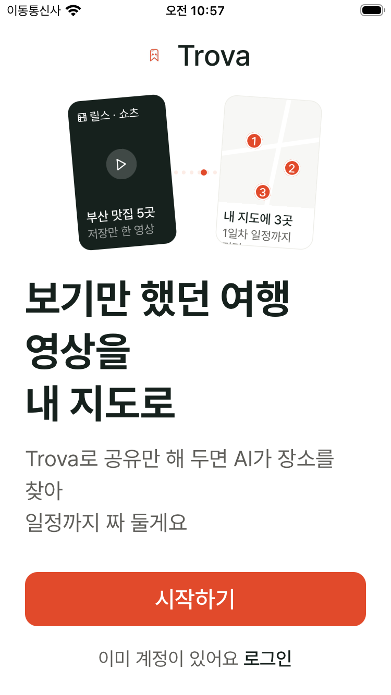
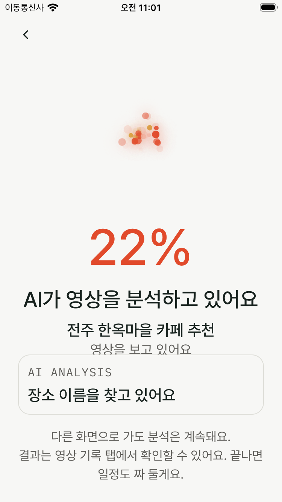
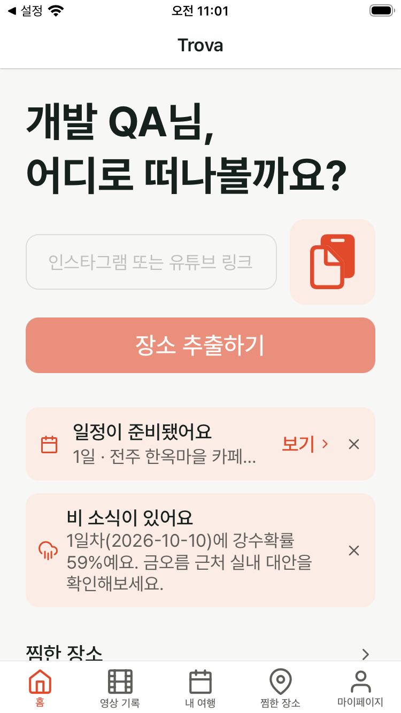
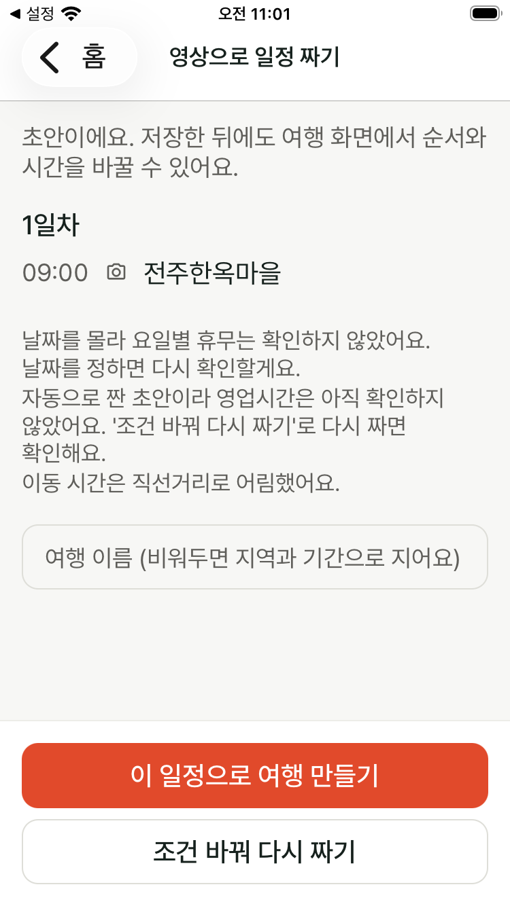
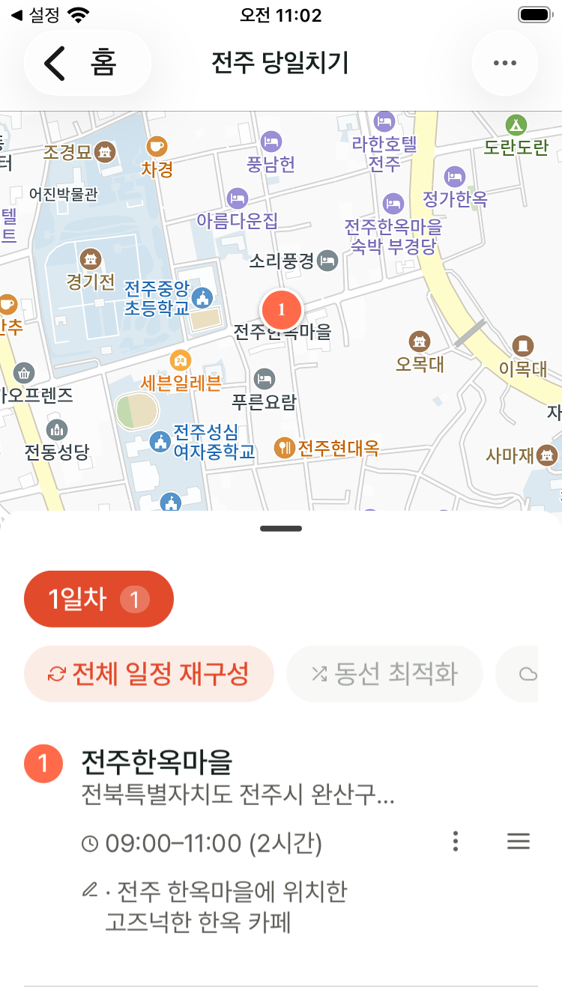
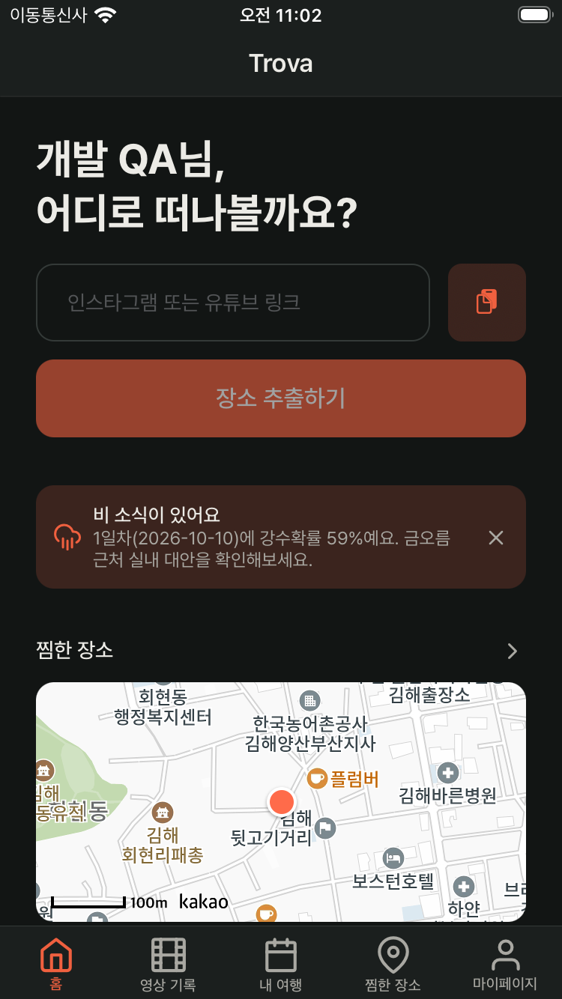
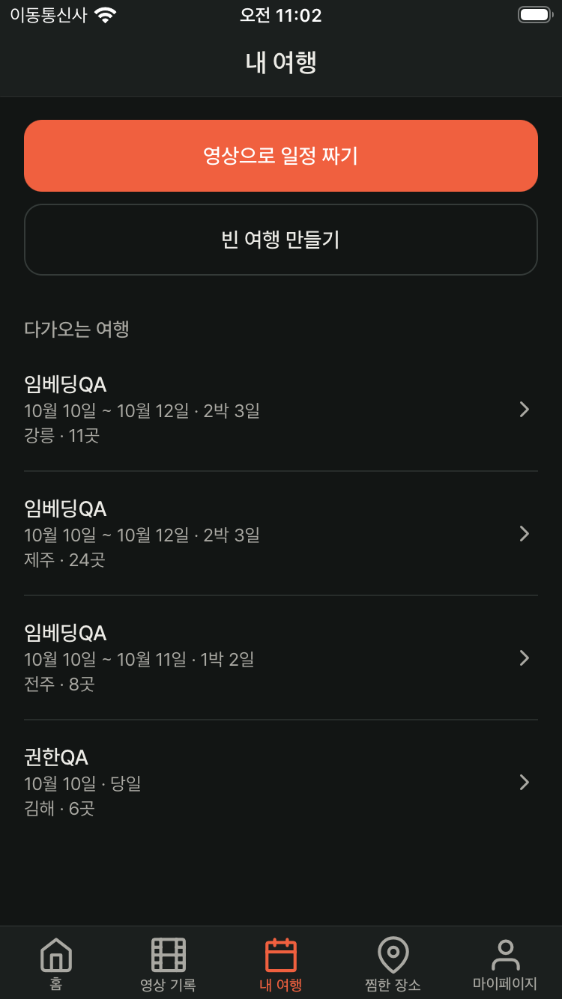
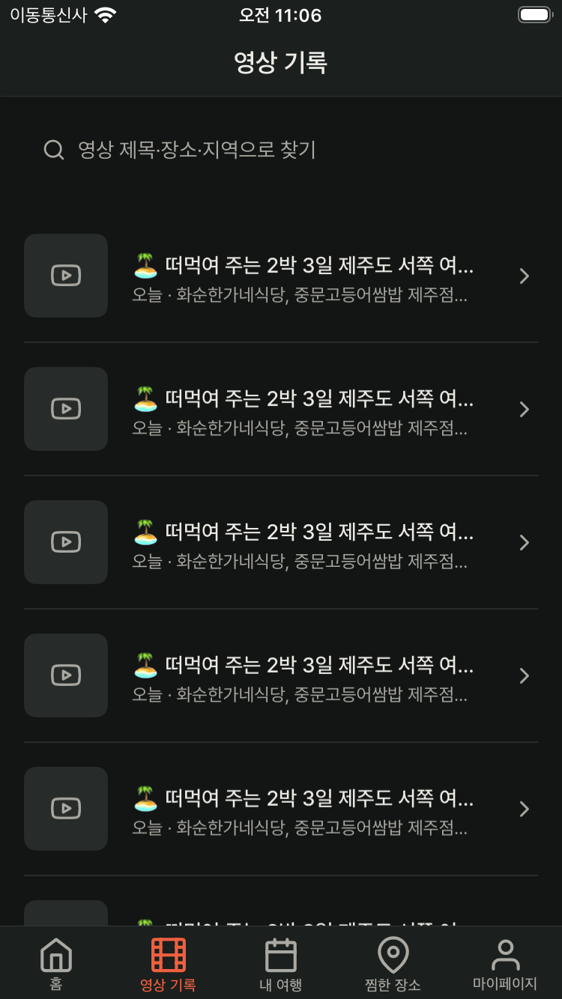
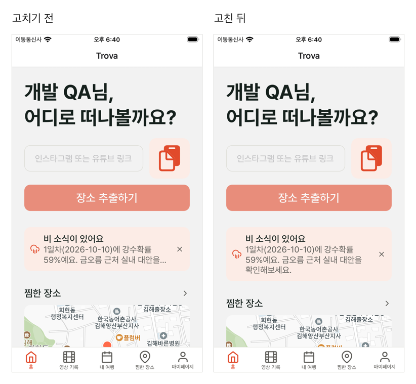

# 화면 캡처

Trova 앱의 대표 화면을 종류별로 모은 곳입니다. 모두 플러그인이 자동으로 찍은 캡처이고, 테스트 계정("개발 QA")과 테스트 데이터만 나옵니다.

- 기기: iPhone SE(시뮬레이터), 로컬 서버 + 개발 DB
- 찍은 도구: [qaflow](https://github.com/taehyeooo/taeng-marketplace/tree/main/plugins/qaflow)(시나리오·페르소나 QA), [uiflow](https://github.com/taehyeooo/taeng-marketplace/tree/main/plugins/uiflow)(디자인 QA)

| 폴더 | 무엇 | 찍은 날 |
|---|---|---|
| [01-onboarding](01-onboarding) | 첫 실행 소개 화면 | 2026-10-08 |
| [02-share-to-trip](02-share-to-trip) | 핵심 흐름: 영상 링크 공유 → AI 분석 → 자동 일정 초안 → 여행 | 2026-10-08 |
| [03-screens](03-screens) | 주요 탭 화면(다크 모드) | 2026-10-08 |
| [04-design-qa](04-design-qa) | 글자 크기별 화면 훑기, 고치기 전·후 비교 | 2026-10-07 |

## 01. 첫 실행

| 소개 화면 |
|---|
|  |

## 02. 공유 → 자동 일정 → 여행

qaflow 시나리오 `share-to-trip` 13단계를 손 탭 없이 52초에 돌린 결과입니다(2026-10-07 첫 실행 기준).

| 1. 영상 분석 | 2. 홈의 일정 카드 | 3. 자동 일정 초안 | 4. 여행 |
|---|---|---|---|
|  |  |  |  |

전체 단계와 단계별 시간: [scenario-all-steps.png](02-share-to-trip/scenario-all-steps.png)

## 03. 주요 화면 (다크 모드)

페르소나 QA에서 찾은 "다크 모드 미지원"을 고친 뒤(#2) 다시 찍은 화면입니다.

| 홈 | 내 여행 | 영상 기록 |
|---|---|---|
|  |  |  |

## 04. 디자인 QA

- [text-size-sweep-home.png](04-design-qa/text-size-sweep-home.png): 홈을 글자 크기 3단계로 한 번에 찍어(약 10초), 가장 큰 글자에서 "비 소식" 안내 문장이 잘리는 것을 찾았습니다.
- [weather-banner-before-after.png](04-design-qa/weather-banner-before-after.png): 같은 배너를 고치기 전과 고친 뒤로 나란히 비교했습니다.

